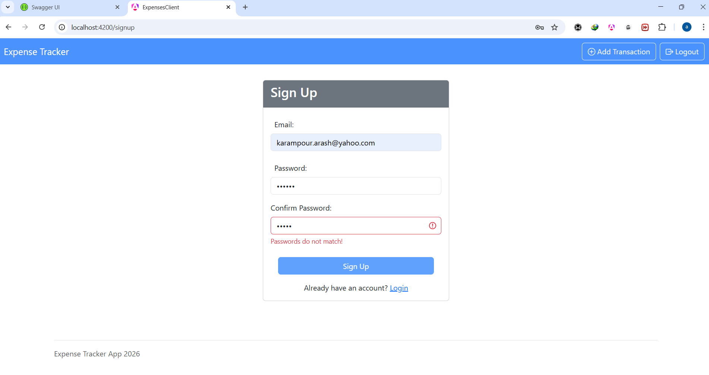
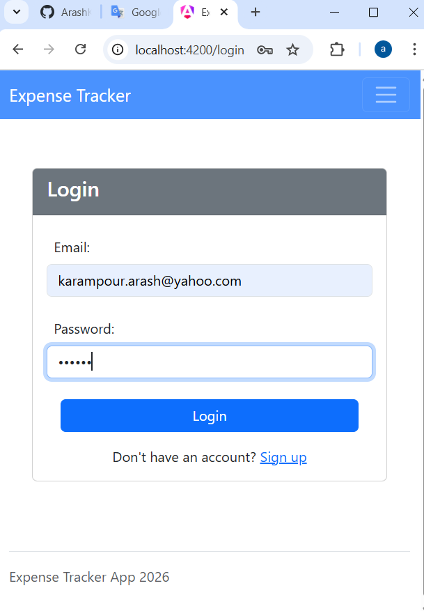
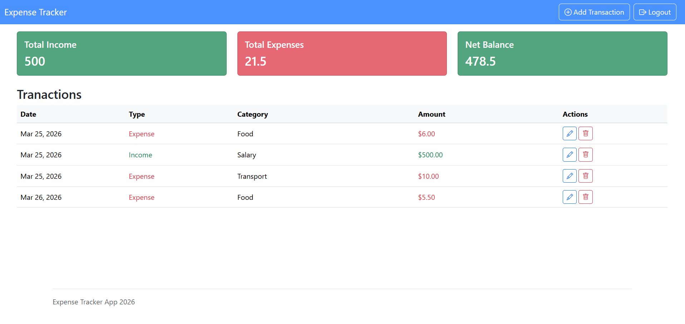
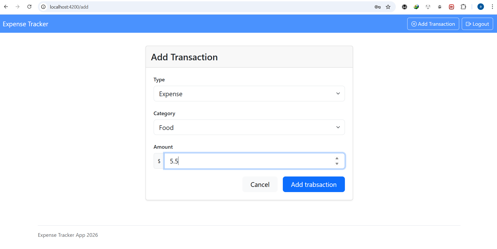
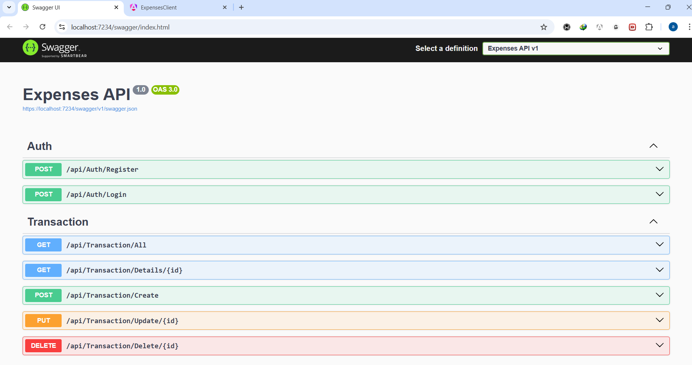

# Expense Tracker Application

This project is an expense tracker application built with Angular version 18 for the frontend and for the backend, ASP.NET Web API is used. 

The application allows users to track their expenses, and manage thier income and costs bahaviour, and visualize their spending patterns.

This application provides features such as:

- Adding an expense with the appropriate type and amount

- Adding an income with the appropriate type and amount

- Editing and deleting existing expenses and incomes

- Viewing a summary of expenses and incomes

- Visualizing spending patterns with charts and graphs

- User authentication and authorization to ensure data security in frontend and backend

## Technologies Used

- Angular 18 for the frontend development
    - Bootstrap and SCSS for responsive design and styling

    - State management for sharing user secure token using RxJs(BehaviorSubject)
    inside a service.

- ASP.NET Web API for the backend development
    - Entity Framework for database management

    - MySQL for data storage

    - JWT for user authentication and authorization

## Installation and Setup
1. Clone the repository to your local machine.

2. Navigate to the project directory and install the dependencies for both frontend and backend.

3. For the backend, configure the database connection string in the `appsettings.json` file.

4. Run the backend server using the command `dotnet run` in the terminal.

5. For the frontend, navigate to the Angular project directory and run `ng serve` to start the development server after installing the dependencies using `npm install`.

## How does the app look like?

The focous of this app was on connecting the frontend and backend, so the design is simple and basic, but it provides all the necessary features for tracking expenses and incomes effectively.

The app has a responsive design, allowing users to access it from various devices, including desktops, tablets, and smartphones. The user interface is intuitive and user-friendly, making it easy for users to navigate through the application and manage their expenses and incomes efficiently.

  

